<picture>
  <source media="(max-width: 520px) and (prefers-color-scheme: dark)" srcset="assets/signal-mobile-dark.svg">
  <source media="(max-width: 520px)" srcset="assets/signal-mobile-light.svg">
  <source media="(prefers-color-scheme: dark)" srcset="assets/signal-dark.svg">
  <source media="(prefers-color-scheme: light)" srcset="assets/signal-light.svg">
  
</picture>

I'm an Artificial Intelligence student at **Shandong University**. I'm curious about how models learn patterns and turn observations into actions.

### Learning from spikes

[**stdp-mnist**](https://github.com/Yukikazct/stdp-mnist) — comparing online STDP and a Hebbian rate approximation on MNIST, with Brian2 and Numba.

### Acting on pixels

[**chrome_dino**](https://github.com/Yukikazct/chrome_dino) — using screenshot-based obstacle detection to decide when to jump or duck in Chrome Dino.

Right now, I'm studying **spiking neural networks**, **attention and optimization in PyTorch**, and **tool use in LLM agents**.

Coursework & foundations

[Machine learning](https://github.com/Yukikazct/machine_learning) · [Brain-inspired computing](https://github.com/Yukikazct/Brain_inspired_Computing) · [Big data](https://github.com/Yukikazct/bigdata-labs) · [AutoReproducer](https://github.com/Yukikazct/AutoReproducer) (team coursework)

---

Python · PyTorch · NumPy · OpenCV · Java  
[Yukikazct@gmail.com](mailto:Yukikazct@gmail.com)
